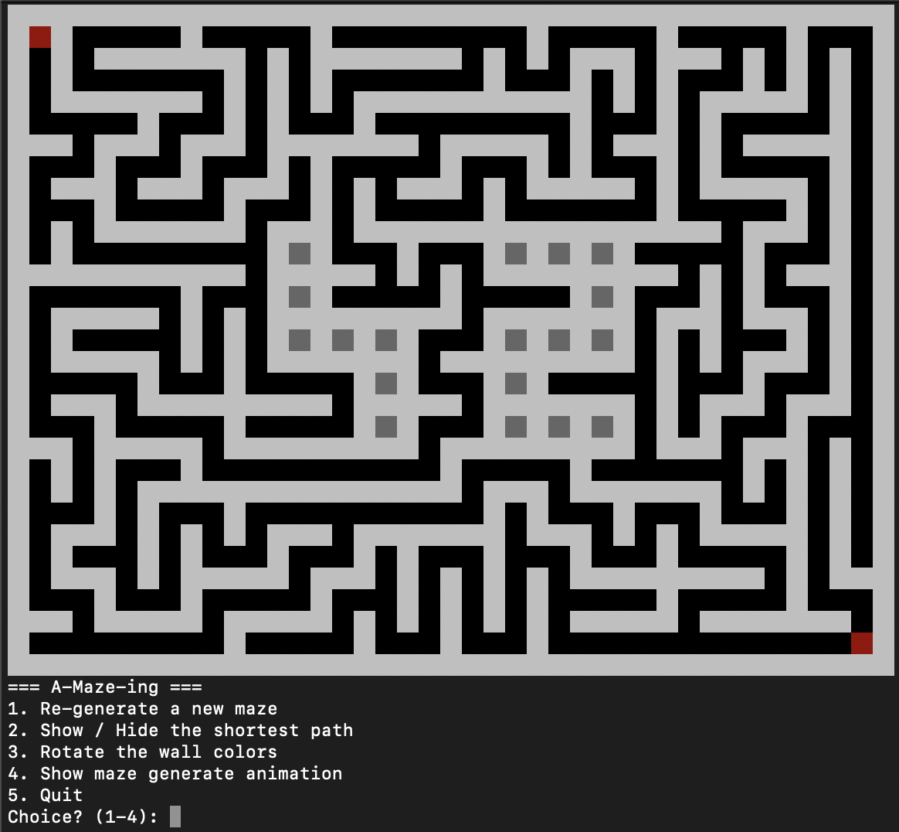
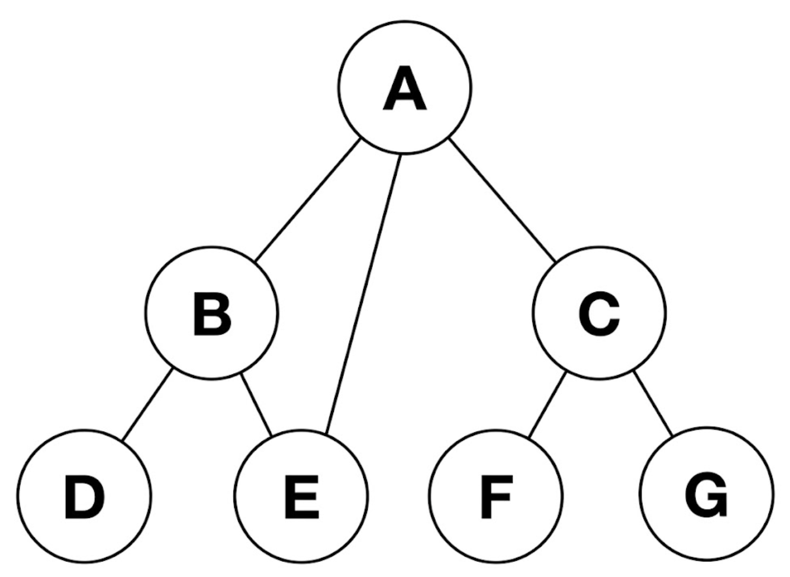
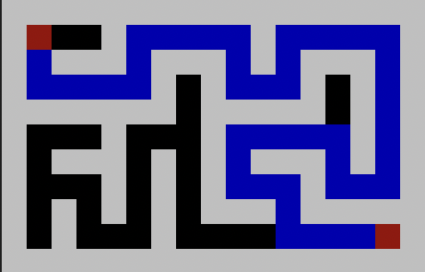

*This project has been created as part of the 42 curriculum by aiwane and tsugimot.*

# A-Maze-ing

## Description
A-Maze-ingは42cursusのMilestone2のペア課題です。迷路生成、最短経路の導出、ビジュアライズをするのが主な内容をなっています。  
迷路生成について、採用したアルゴリズムは**Prims**, **Kruskal**, **recursive backtracker**です。これらの実装を通して迷路生成アルゴリズムの基礎を学べます。迷路の中心には42の文字を表示させます。完全迷路と、Pαc -Manで使用可能な不完全迷路の切り替えをできるようにします。  
最短経路の導出について、**幅優先探索(Breadth First Search)**を採用しています。木構造の探索方法を学ぶことができます。  
ビジュアライズについて、選択制となっており、**Ascii Rendering**あるいは**Minilibx**を使用します。今回は**Ascii Rendering**を採用しました。ターミナルにおけるビジュアライズの基礎が学べます。  

## Usage(Instruction)
実行方法の解説をします。  
githubあるいはvogsphere(42専用のgit)にリポジトリからクローンしてきます。  
```bash
# githubからのクローンの場合
git clone https://github.com/takutotakuto1121-creator/A-Maze-ing.git a-maze-ing
```
```bash
# vogsphereからのクローンの場合
git clone <git@vogspherに続くアドレス>
```
リポジトリのディレクトリに移動します。 
```bash
cd a-maze-ing
```
config.txtの内容を自分好みに改変します。デフォルトでは以下の内容が設定されています。よくわからない場合は何も変更しなくて構いません。
```
# コメントを記述できます
WIDTH=20
HEIGHT=15
ENTRY=0,0
EXIT=19,14
OUTPUT_FILE=maze.txt
PERFECT=True
# 以下の設定も追加できます
# SEED=42などの整数(何も指定しないと、42になります。)
# STRATEGY=kruskals, prims, recursiveのいずれか(何も指定しないと、recursionになります。)
```
仮想環境を作成します。  
```bash
python3 -m venv venv
```
仮想環境をactivateします、
```bash
source venv/bin/activate
```
パッケージをインストールします
```bash
pip install -r requirements.txt
```
以下のコマンドで実行します。
```bash
make run
```
すると、以下のように迷路と選択肢が出力されます。

選択肢に表示されている通り.  
1を入力し、Enterを押すと、迷路が再生成されます。  
2を入力し、Enterを押すと、最短経路を表示させたり隠したりできます。
3を入力し、Enterを押すと、迷路の壁の色を変更できます。  
4を入力し、Enterを押すと、アニメーション付きで迷路が再生成されます。  
5を入力し、Enterを押すと、プログラムの実行が中断されます。  
それ以外のを入力し、Enterを押すと、エラーメッセージが表示され、再度入力待ちをします。  
  
もしあなたが42Tokyoの学生なら、、、  
A-Maze-ingのプロジェクトページから、maze_analyzer.pyをインストールし、rootディレクトリに配置
以下のコマンドでmaze.txtが課題の要件を満たしているか確認できます。
```bash
python3 maze_analyzer.py maze.txt
```

## Algorithm
課題の主要部分のみ抜粋して解説します。細かい部分はコードを見てください。
### 迷路生成
**Prim**, **Kruskal**, **recursion**の3つのアルゴリズムを採用しました。理由は課題に代表例として取り上げられていたからです。
アニメーションを表示させると各アルゴリズムへの理解が深まると思うので、ぜひ活用してください。  
まずは、**Prim**, **Kruskal**. **recursion**それぞれのアルゴリズムで迷路を生成します。これによって生成された迷路は木構造になり、任意の二点間の経路は１つしかない完全迷路になります。この時、中心に42の文字を作成できるように、42に該当する部分は壁を破壊できないようにします。
次にこの完全迷路を元に不完全迷路を作成します。  
各アルゴリズムの具体的な解説は以下です。 
#### Prim
#### Kruskal
#### recursion
再帰的なバックトラックを採用。以下のようなアルゴリズムで動作しています。
1. 全てのセルの四方を壁にする。
2. ランダムで任意のセルを選択。そのセルを訪問済みにする。
3. セルの四方のうち、壁がある方角かつその方角の隣のセルが訪問済みでない方角の壁を壊し、道に変更する。
4. 壊した方角のセルに移動。
5. 3, 4を現在のセルの四方のうち、壁がある方角かつその方角の隣のセルが訪問済みでない方角が無くなるまで繰り返す。
6. 一つ前のセルに戻る。
7. そのセルの四方のうち、壁がある方角かつその方角の隣のセルが訪問済みでない方角がああれば破壊して、壊した方角のセルに移動する。なければ、6に戻る。  

以上のように、進めるところまで進んで、進めなくなれば進めるようになるところまで戻り、また進めるところまで進むのを繰り返して全てのセルが訪問済みになるまで繰り返すのがバックトラックによる迷路生成アルゴリズムです。進めるところまで深さ優先で進むアルゴリズムです。

#### 完全迷路から不完全迷路に
以上のアルゴリズムで作成された迷路は、任意の二点間の経路が１つしかない完全迷路になります。  
今回の課題では、config.txtでPERFECT=Trueで指定すると不完全迷路になり、PERFECT=Falseで指定すると不完全迷路になるように指示されています。  
不完全迷路とは、このプロジェクト内では以下のように定義します。Pac-Manで使う迷路をイメージしてください。  
1. 全てのセルに到達できること
2. 四隅と中心は開けていること
3. 任意の二点間の経路は少なくとも２つあること
4. dead-endの最大数を指定できること(ボーナス)  

４について、以下のように実行することにより、dead-endの最大数を指定できる。
```bash
python3 a-maze-ing.py config.txt --max-dead-ends 0
```
以上のような不完全迷路を作成するために、完全迷路を作成してからそれを改変し、不完全迷路にする手法を取りました。完全迷路に対して以下の操作を行うことでそれぞれの項目を満たした不完全迷路に改変されます。
1. 完全迷路は木構造になっているので、元から全てのセルの到達できるので何もしなくてもこの条件は満たせます。
2. 四隅は迷路の外周以外の壁を破壊します。中心は全ての壁を破壊します。
3. 少なくとも１つの壁を壊すと、ループが少なくとも１つできるので、任意の二点間の経路は少なくとも２つになります。
4. dead-endになるセル（４方角のうち３つが壁になっているセル）のうち、max-dead-endsで指定した数（dead-endになるセルの数がmax-dead-endより小さければそのセルの数）を選択し、その壁以外で、壁がある方角からランダムに一つを選び破壊する。

### 最短経路の導出
経路探索の代表的な手法には**幅優先探索**, **深さ優先探索**の2種類があります。前述の通り、迷路は木構造になっています。以下の画像のような木構造を元に解説します。(画像はAIで生成)

幅優先探索は、Aをスタートすると、A,B,E,C,D,,F,Gの順番に探索しゴールを探していきます。  
深さ優先探索は、Aをスタートとすると、A,B,D,E,C,F,Gの順番に探索しゴールを探していきます。  
どちらのアルゴリズムを採用して最短経路を求めても構いませんが、今回は幅優先探索を選択しました。早いからです。早い理由は以下の解説を読めばわかります。それぞれのアルゴリズムを選択した場合にどのように実装すればいいのかを以下で解説します。
#### 幅優先探索(BFS)
探索をしながらゴールを見つけた場合、スタートからゴールまで辿るとそれ自体が最短経路になるので、スタートからの各ノードへのそれぞれの経路を記憶しておき、ゴールを見つけると、ゴールとスタートのノードを繋ぐ経路がそのまま最短経路になります。
#### 深さ優先探索(DFS)
スタートから開始し、幅優先でゴールを探索します。各ノードへの経路を保存しておきます。ゴールを見つけると、ゴールとスタートを結ぶ経路が最短経路です。というようにしてはいけません。深さ優先探索は深さ優先でとりあえず一つでも経路を見つければ終了してくれるので、場合によっては幅優先より早く経路を求めてくれるというメリットはある一方で、必ずしもそれが最短経路とは限りません。１工夫しなければなりません。工夫の１つの案としては、DFSで進める深さの限界値を決めておくことです。最初は限界値を1に設定します。限界値が1の探索でゴールに辿り着けなければ限界値を2にして再度探索します。このようにDFSの限界値を1ずつ増加させて探索していけば最初にゴールを見つけたとき、それは最短経路になります。BFSと比較すると、DFSの方が早いことも確かにあり得ますが、全体的に見るとこの方法では何回もBFSを行わないといけないので、基本的にはBFSの方が早そうです。

### ビジュアライズ
以上のようにして生成した迷路およびその最短経路をビジュアライズします。ビジュアライズの方法は**Ascii rendering**, **Minilibx**からの選択制です。今回はAscii renderingを採用しました。理由は簡単だからです。  
#### Ascii rendering
迷路をターミナルに視覚的にわかりやすく出力できればOKです。形式はどのようにしても構いません。例えば、以下のようにビジュアライズする方法が考えられます。
```
こんなんとか
@@@@@@@@@@@@@@@@@@@@@@@@@
@ S     @       @       @
@@@@@ @ @@@ @@@ @ @@@@@ @
@     @   @   @ @     @ @
@ @@@@@@@ @ @ @ @@@@@ @ @
@       @ @ @ @     @ @ @
@@@@@@@ @ @ @ @@@@@ @ @ @
@     @ @   @     @   @ @
@ @@@ @ @@@@@@@@@ @@@@@ @
@   @         @       G @
@@@@@@@@@@@@@@@@@@@@@@@@@
```
```
こんなんとか
┌───┬───┬───┬───┬───┬───┬───┬───┐
│ S     │       │       │   │   │
├───┤ │ ├───┐ │ ├───┐ │ ┤ │ │   │
│   │ │ │   │ │ │   │ │ │   │.  │
│ ┌─┴─┘ │ ┤ │ ├─┴─┐ │ ├─┴─┐ │.  │
│ │     │ │ │ │   │ │ │   │ │.  │
│ ├───┐ │ │ │ │ ┌─┘ │ ├───┤ │   │
│ │   │ │   │   │   │   │ │     │
│ │ ┌─┘ ├───┤ ├─┘ ┬ │ ├───┤ │
│   │ │     │     │ │     G │
└───┴─┴─────┴─────┴─┴─────┴───┘
```
ただ、もっとかっこいい迷路を作りたいので、ANSIエスケープシーケンスを用いで実装しました。
##### ANSIエスケープシーケンスとは
ANSIエスケープシーケンスとは、ターミナルに出力する文字やその背景に色をつける仕組みです。例えば以下のコマンドを実行すると、文字の背景に色がついた文字が出力できます。(Enumの説明は省略。気になれば調べてください！)
```bash
echo 'from enum import Enum

class Color(Enum):
    WHITE = "\033[47mwhite\033[0m"
    BLACK = "\033[40mblack\033[0m"
    BLUE = "\033[44mblue\033[0m"
    RED = "\033[41mred\033[0m"

print(Color.WHITE.value)
print(Color.BLACK.value)
print(Color.BLUE.value)
print(Color.RED.value)
' > ansi.py

python3 ansi.py
```
背景に色をつけることができました。では、文字を半角スペース2つに変えた以下のようにすると、各色の正方形が出力されます。
```bash
echo 'from enum import Enum

class Color(Enum):
    WHITE = "\033[47m  \033[0m"
    BLACK = "\033[40m  \033[0m"
    BLUE = "\033[44m  \033[0m"
    RED = "\033[41m  \033[0m"

print(Color.WHITE.value)
print(Color.BLACK.value)
print(Color.BLUE.value)
print(Color.RED.value)
' > ansi.py

python3 ansi.py
```
これをうまく活用すれば、以下のように迷路を作成できます。


##### Minilibxとは
42Tokyoが学生の学習用に作成した、x-windowをベースに作成されたビジュアライズの簡単な機能のみを使用できるようにしたCのライブラリMinilibxのpythonラッパー。詳しい情報は[42公式のgithub](https://github.com/42school/mlx_CLXV)をご覧ください。私もよくわかりません。教えてください。

### 迷路生成アニメーション

### パッケージ化について（おまけ）

## Structure
### ファイル構造
```
a-maze-ing
├── a_maze_ing.py
├── config.txt
├── LICENSE.md
├── Makefile
├── maze_analyzer.py
├── mazegen
│   ├── __init__.py
│   ├── bfs.py
│   ├── maze_gen_kruskals.py
│   ├── maze_gen_prims.py
│   ├── maze_gen_recursive.py
│   ├── maze_generator.py
│   └── visualizer.py
├── mazegen-1.0.0-py3-none-any.whl
├── pyproject.toml
├── README.md
├── requirements.txt
└── screenshots
    ├── maze_ansi.png
    ├── maze_result.png
    └── tree_construction.png
```
### クラス構造
課題の指示で、迷路生成クラスMazeGeneratorを使用しなけらなならないため、命名は不規則になってしまった。
```
MazeGeneratorBasic
├── MazeGenerator
├── MazeGeneratorPrims
└── MazeGeneratorKruskals
BredthFirstSearch
Visualizer
```

## Resources
### 使用したツール
**pydantic**を使用しました。
データのヴァリデーションを楽に行えるようにするパッケージです。詳しい情報は[pydanticの公式サイト](https://pydantic.com.cn/ja/)をご覧ください。

### ペア課題の進行
#### 主な役割分担
aiwaneは以下のファイルを作成.  
1. mazegen/maze_gen_prims.py  
1. mazegen/maze_gen_kruskals.py

tsugimotはそれ以外のファイルを作成 
#### 計画と結果
一週間で全てを終わらせようと計画。結果、間に合わず2日余分にかかってしまう。
#### うまくいったこと
1. 仲良くなったよ
2. バックトラックによる完全迷路生成、bfsは1日目で終了！
3. ボーナスまで全部できたよ
#### 改善点
1. MazeGeneratorBasicを継承するクラスのself._*をクラスの外で使用してしまっているので改善できる。
2. 思いつくがままに書いてしまったので、事前に設計を練っていれば更に可読性の高いコードになっていた。
3. Minilibxを用いたビジュアライズにもチャレンジしたい
4. gitを全然活用できなかった。pull, add, commit, push以外わからん！

### AIの使用
コードの基盤は全て手書きで実装しています。  
非本質的作業の負担軽減を目的とし、一部例外的にAIを使用した部分は以下に列挙します。
1. flake8, mypyエラーの解消
2. docstringの記述
3. mazegen/visualizer.pyにて、Colorクラスの記述
4. mazegen/visualizer.pyにて、Visualizerクラスのchange_colorメソッドの記述
5. screenshots/tree_construction.pngの作成

### 参考文献
[迷路生成アルゴリズムが沢山載っているサイト](https://www.jamisbuck.org/mazes/)   
[深さ優先、幅優先探索とは何かを解説してくれるサイト](https://manabitimes.jp/math/1247)  
[ANSIエスケープシーケンスの解説サイト](https://docsaid.org/ja/blog/colorful-cli-with-ansi-escape-codes/)  


